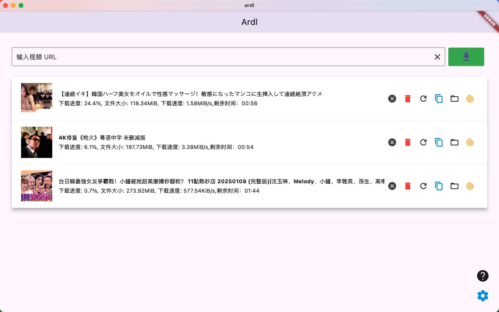
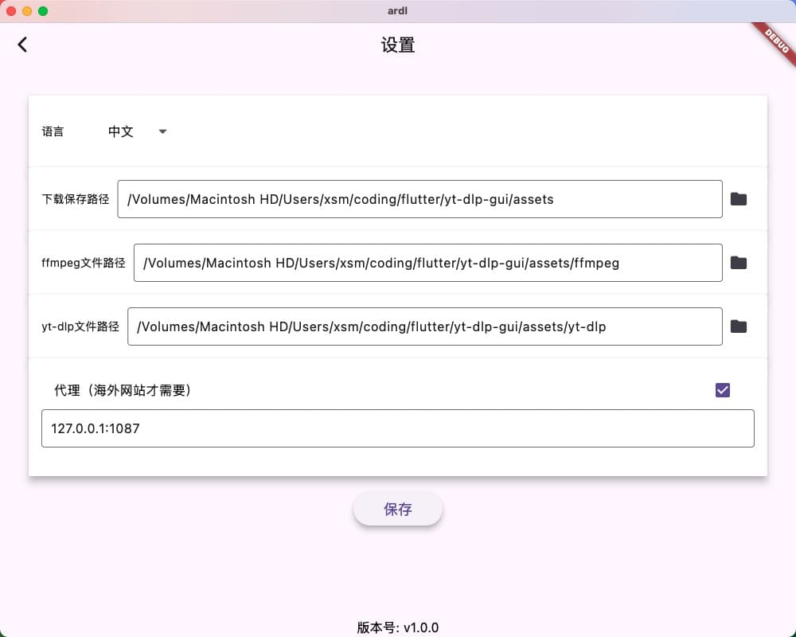

# Ardl - 一个基于Flutter 3的yt-dlp图形界面

Ardl是一个方便易用的桌面应用程序，提供了一个简洁友好的图形界面来使用[**yt-dlp**](https://github.com/yt-dlp/yt-dlp)进行视频下载。无论是Windows还是Mac用户，都能通过Ardl轻松下载在线视频内容，而无需担心复杂的命令行操作。

## 主要功能

- **简化下载流程**：只需输入URL，即可开始下载您喜欢的视频。
- **支持代理设置**：允许用户配置代理服务器以适应不同的网络环境。
- **自定义路径设置**：可灵活设定下载文件、yt-dlp和FFmpeg的存储位置。
- **Cookie管理**：一键保存登录状态，免去每次手动输入cookie的麻烦。
- **跨平台兼容性**：完美适配Windows与macOS系统。

## 快速开始

### 准备工作

在运行Ardl之前，请确保已准备好以下依赖项：

1. [FFmpeg](https://www.ffmpeg.org/download.html)
2. [yt-dlp](https://github.com/yt-dlp/yt-dlp/releases)

上述软件下载后并确保它们具有执行权限,后面需要在软件里面设置好他们所在的目录  

macos应该要执行
```
chmod +x ffmpeg
chmod +x yt-dlp
```

### 安装依赖

打开终端并运行以下命令来安装项目所需的依赖包：

```bash
flutter pub get
```

### 构建资源文件

生成必要的资源类：

```bash
dart run build_runner build
```

### 多语言支持

为了启用多语言支持，请运行：

```bash
flutter gen-l10n
```

### 启动应用

一切就绪后，可以通过以下命令启动Ardl：

```bash
flutter run
```

## 界面概览

- **首页**：简洁直观的操作界面
- **设置页面**：全面的配置选项，包括代理设置、下载路径
- **Cookie获取**：内置浏览器，获取cookie。


*图：首页*


*图：基本设置*


*图：保存Cookie*

---

自学了两周flutter 写的代码也是很乱 不过在自己的macos15.1和win11是正常运行的  

由于本人没有证书这个项目只能自己本地使用，前提你会flutter开发  

支持下载的网站可以看这里[yt-dlp supportedsites](https://github.com/yt-dlp/yt-dlp/blob/master/supportedsites.md)

